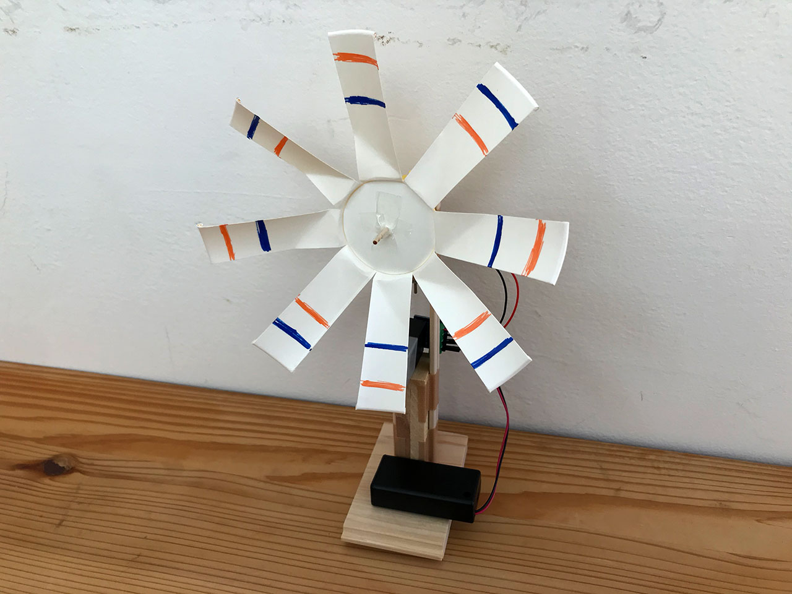

# Sony MESHを使い風車をまわすワークショップ
Sony MESHを使い簡単な風車を作ってまわします。

## 概要

* 対象年齢：5歳以上
* 所要時間：20分から30分（お手軽体験バージョン）
* 主な機材：MESH（GPIO、人感、動き、ボタン）／Windows PCまたはiPad／ MESH用モータドライバ／モーター／電池／紙コップ／割り箸 etc

## レシピ詳細

[ワークショップのレシピ](recipe.md)

## 資料

* 風車の土台部分の作り方
  * [リンク](howtomake_base/howtomake_base.md)
  * [PDF](howtomake_base.md/howtomake_base.pdf)
* モーターとMESH（GPIO） をつなぐ回路の作り方
  * [リンク](howtomake_connection/howtomake_connection.md)
  * [PDF](howtomake_connection/howtomake_connection.pdf)
* プロペラ部分の作り方
  * [リンク](howtomake_fun/howtomake_fun.md)
  * [PDF](howtomake_fun/howtomake_fun.pdf)
* MESHアプリのレシピの作り方
  * [リンク](mesh_recipe/mesh_recipe.md)
  * [PDF](mesh_recipe/mesh_recipe/pdf)

## ワークショップ実施履歴

* [2019/12/01「まなびカフェ  IoTプログラミング体験」@manabino](https://www.facebook.com/events/1446982945469237/)

## この資料について

この資料は山辺真幸が実施した（または実施予定の）ワークショップのレシピを公開したものです。安全に実施できるよう配慮していますが、いかなる損害の賠償や補償もいたしかねます。利用される方の責任においてご利用ください。

ご質問、間違いの指摘など歓迎です。プルリクまたはメールにてお送りください。

masakiyamabe[at]gmail.com

### 著作権について

[クリエイティブ・コモンズ（表示4.0国際）](https://creativecommons.org/licenses/by/4.0/deed.ja )ライセンスに従うかぎりにおいて、商用利用を含め、自由に複製または改変して無償でご利用いただくことが可能です。その場合は利用者が見える場所に下記の内容を表示してください。

__①紙媒体で利用する場合__

> 「Sony MESHを使い簡単な風車を作る」
> ©山辺真幸（クリエイティブ・コモンズ（表示4.0国際））
> https://creativecommons.org/licenses/by/4.0/

__②ウェブで利用する場合__

> 「Sony MESHを使い簡単な風車を作る」
> ©山辺真幸（[クリエイティブ・コモンズ（表示4.0国際）](https://creativecommons.org/licenses/by/4.0/)）

__③改変したものを紙媒体で利用する場合__

> 「Sony MESHを使い簡単な風車を作る」を改変
> ©山辺真幸（クリエイティブ・コモンズ（表示4.0国際））
> https://creativecommons.org/licenses/by/4.0/

__④改変したものをウェブで利用する場合__

> 「Sony MESHを使い簡単な風車を作る」を改変
> ©山辺真幸（[クリエイティブ・コモンズ（表示4.0国際](https://creativecommons.org/licenses/by/4.0/)））
