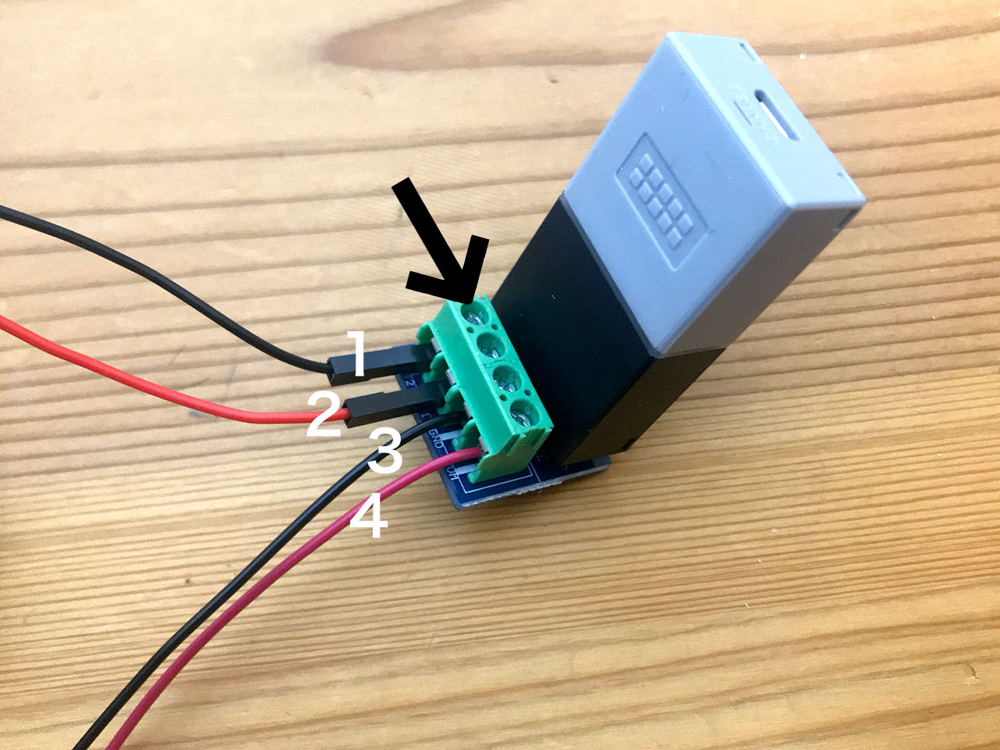

# MESHとモーターをつなぐ

つなぐパーツは次に4つです。

1. ギアドモーター
2. 電池ボックス
3. MESH(GPIOタグ)
4. モータードライバー

# モータードライバーとGPIOタグの接続

図のように差し込みます。（タグの向きを間違えないように）

# 電池ボックス、モーターをつなぐ

モータードライバーのゲートと、電池ボックス、モーターを図のようにつなぎましょう。ゲートの上にあるネジ（矢印の部分）をドライバーで回すと、ゲートが閉まりケーブルが固定されます。きつく締めすぎないように注意。

1. モーターのケーブル（黒）
2. モーターのケーブル（赤）
3. 電池ボックスのケーブル（黒）
4. 電池ボックスのケーブル（赤）

