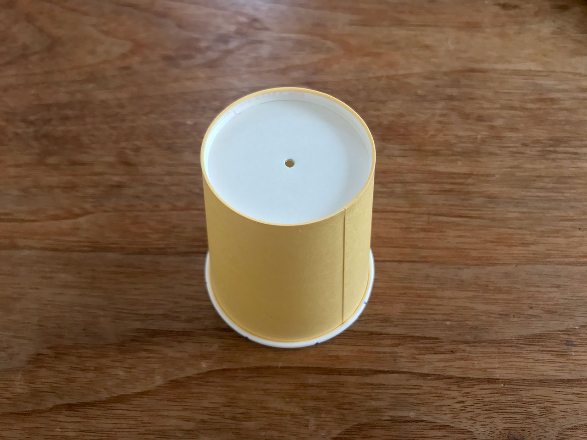
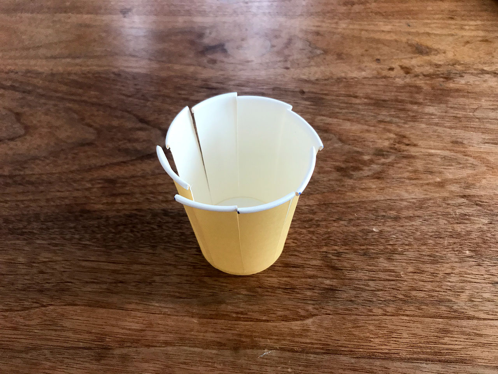
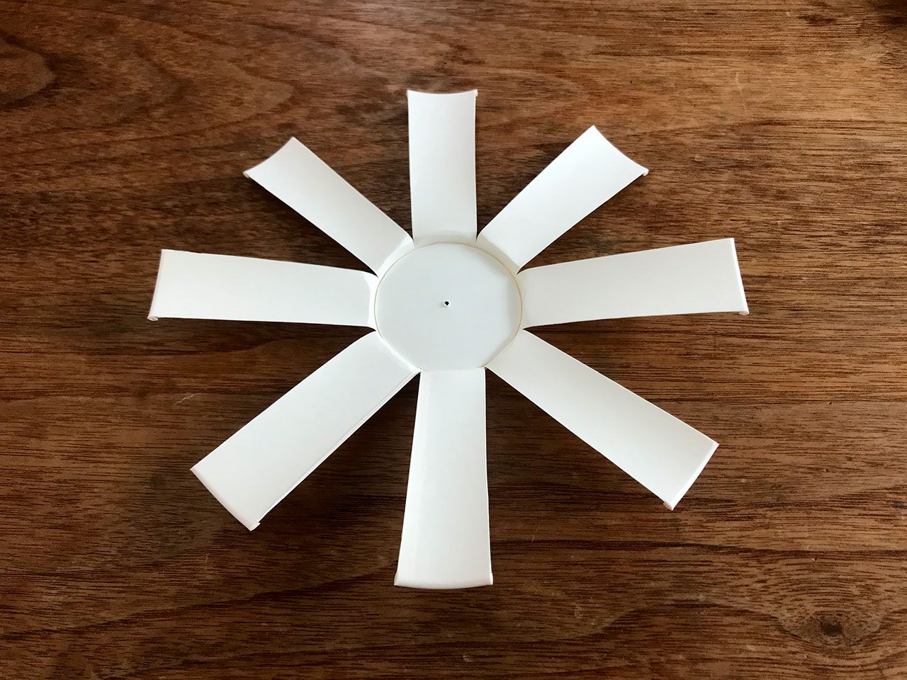
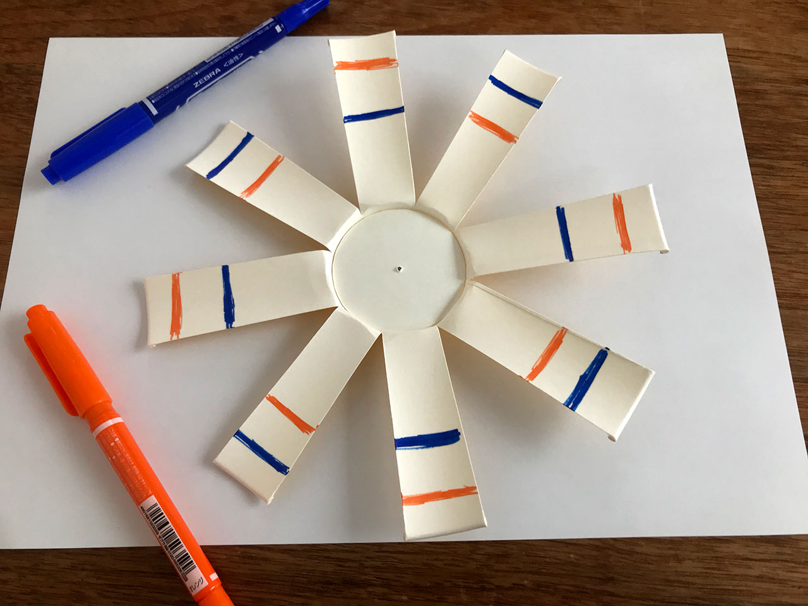
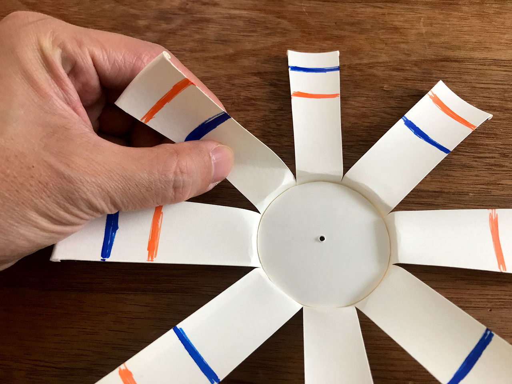
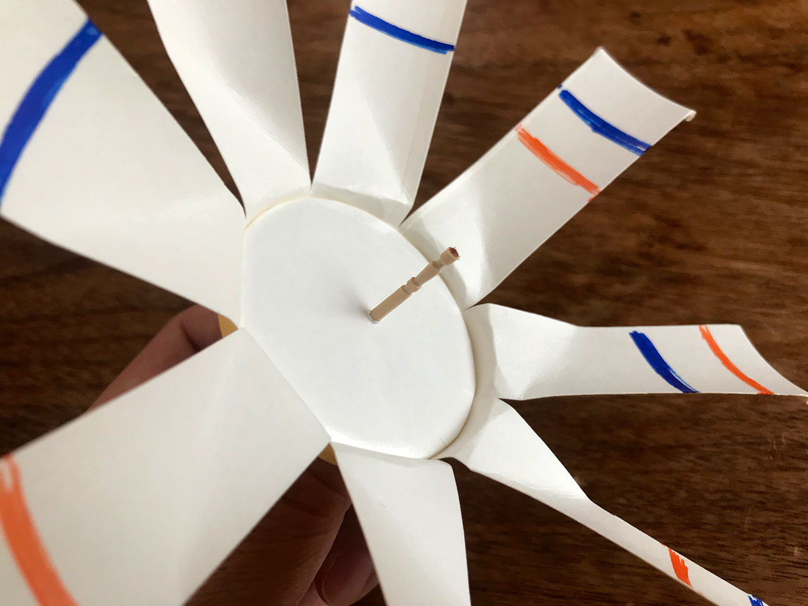
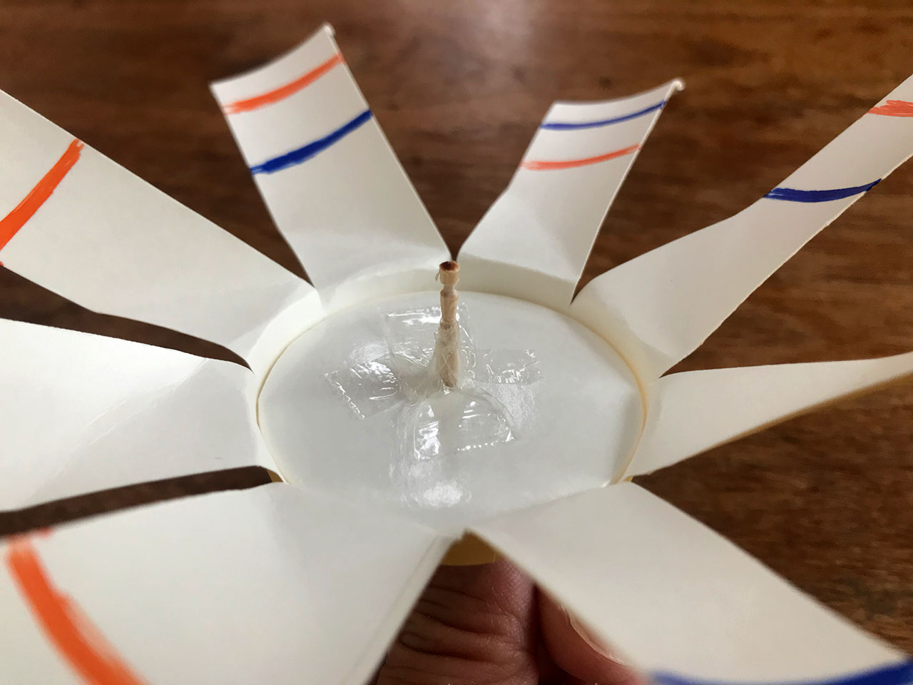
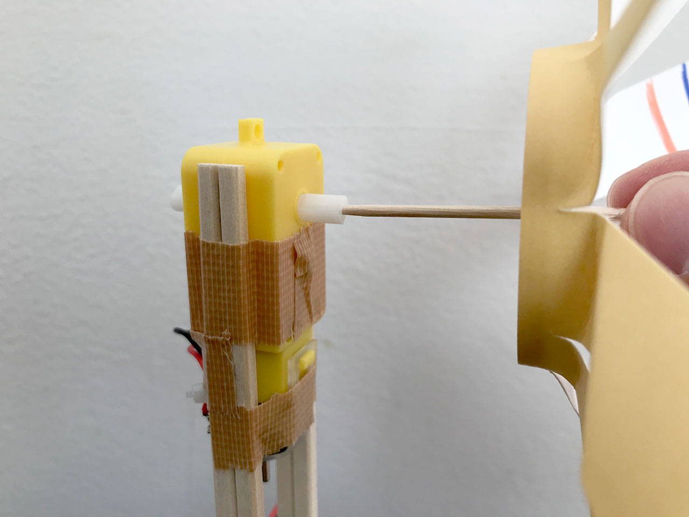

# ①コップを<ruby>逆<rt>さか</rt></ruby>さまにして<ruby>中心<rt>ちゅうしん</rt></ruby>に<ruby>穴<rt>あな</rt></ruby>を<ruby>開<rt>あ</rt></ruby>けます

## 

# ②8ヶ所に切りこみを入れて

#③羽の部分を広げましょう

# ④羽や<ruby>底<rt>そこ</rt></ruby>の部分に絵を描いて、かざりましょう

# ⑤よくまわるように羽を少し折り曲げます

# ⑥あけた穴につまようじをさしこみます

# ⑦セロテープで固定します

# ⑧モーターの<ruby>軸<rt>じく</rt></ruby>にまっすぐ<ruby>奥<rt>おく</rt></ruby>までさしこみます

もしモーターを回した時に風が吹き出してこない時は、羽の回転が逆になっています。その時は、モーターの反対側の軸に差し込んでください。

# 完成！

# 横から見たところ

